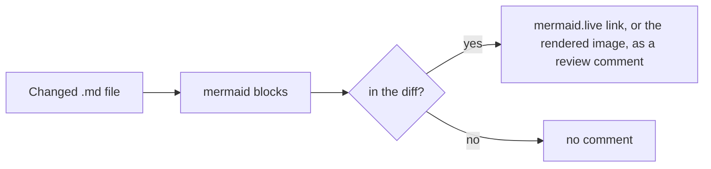

# Smoke fixture

This file exists so a pull request that edits it exercises the action on
itself (the smoke job in ci.yml). Change the diagram to see a new link.

```mermaid
flowchart LR
  md[Changed .md file] --> blocks[mermaid blocks]
  blocks --> diff{in the diff?}
  diff -- yes --> link[mermaid.live link, or the rendered image, as a review comment]
  diff -- no --> skip[no comment]
```

Text after the block.
